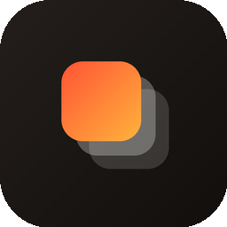

<p align="center">
  
</p>

<h1 align="center">PosterLab</h1>

<p align="center">
  Design <code>.tendies</code> lock-screen wallpapers directly on your iPhone, then flash them without rebooting. Also skins Apple Wallet cards and themes the passcode dialer. iOS 18+, no jailbreak.
</p>

<p align="center">
  
  
  
  
</p>

---

## What's in the box

PosterLab is a six-tab iPhone app:

| Tab | What it does |
| --- | --- |
| **Pairing** | Set up (or import) a lockdown pairing record and watch LocalDevVPN loopback status. |
| **Create** | A full wallpaper editor — layers, Vision subject cut-out, particles, lock↔home transitions, PosterBoard emulator preview. Export is a real `.tendies` package. |
| **Wallet** | Replace the artwork of any Apple Wallet card (single card or batch). Scans the Wallet UI live to pick up card IDs the moment Apple Pay opens. |
| **Passcode** | Design passcode-dialer themes — either one poster sliced across the ten keys, or individual circular key cutouts. Imports/exports `.passthm`. |
| **Flash** | Picks up anything you (or **Create**) drop into the Wallpapers Library and writes it into PosterBoard storage. Triggers a NeoSpring respring so wallpapers apply without a reboot. |
| **Credits** | Who did what. |

## The wallpaper editor

The editor targets the exact PosterBoard poster size (390 × 844 pts) and produces ParameterizedCA output that PosterBoard already knows how to render — the same format CAPlayground spits out, just assembled on-device.

- **Layers** — photos, text, SF Symbol stickers; each layer gets position, scale, rotation, opacity, blend mode, spin and a one-shot reveal animation (fade / slide / zoom / spin-in).
- **Subject cut-out** — Vision's foreground-subject request runs locally; the extracted subject moves to the `FLOATING` group so it renders *in front of* the lock-screen clock (depth effect).
- **Particles** — full-screen snow (adjustable fall angle), rain, petals, embers, stars, confetti, bubbles. Density and speed are live-tunable with sliders.
- **Lock ↔ Home transitions** — each layer can slide off, fly in from off-screen, change opacity or scale when you swipe from the lock screen to the home screen. A built-in PosterBoard emulator (swipe up gesture) plays the transition without leaving the app.
- **Add to Library** — the export sheet has a direct "Add to Wallpapers Library" button. Long-pressing a wallpaper on the Create grid gives the same action. Either way the `.tendies` lands in the Flash tab ready to be sent to PosterBoard.

Under the hood: `ios-app/TendiesFormat/` writes `wallpaper.ca` as CAML (CoreAnimation XML), the descriptor plists as `NSKeyedArchiver` graphs, and zips the whole `descriptors/<uuid>/versions/1/…` tree. Y coordinates are flipped at the editor → CAML boundary because CAML roots use `geometryFlipped=0` (OpenGL-style, +Y up) while the editor stores positions in UIKit top-down normalized space — see `TendiesExporter.makeLayerItem`.

## How on-device flashing works

PosterLab talks to internal lockdown services over a local loopback tunnel (`10.7.0.1` or `127.0.0.1`) provided by LocalDevVPN / WireGuard. The heavy lifting — the AirTraffic sync sandbox escape itself — happens in **`AirliftFFI`**, a Rust static library (see `rust-core/`) with iOS arm64 and arm64-simulator slices, bridged into Swift via `@_silgen_name` plus a thin Objective-C helper (`ObjC/GrappaHelper.m`). The same backend writes Passbook caches, `TelephonyUI-10` dialer assets and PosterBoard wallpaper storage.

The flasher step itself is tiny: pick targets in the UI → PosterLab packs the files → sends them through the tunnel → PosterBoard notices the new descriptor → NeoSpring reloads SpringBoard via WebKit's GPU process. No reboot, no jailbreak.

## Device requirements

- iPhone running **iOS 18.0 or newer** (iOS **27+** needed only if you want to pair on-device from Settings).
- **LocalDevVPN / WireGuard** in loopback mode (`10.7.0.1` or `127.0.0.1`) — PosterLab shows a green pill in the Pairing tab when it detects the tunnel.
- A lockdown **pairing record** — see below.

## Getting a pairing record

Pick whichever applies to you:

- **SideStore** — Files › On My iPhone › SideStore › `ALTPairingFile.mobiledevicepairing` → import.
- **LiveContainer (SideStore inside)** — Files › On My iPhone › LiveContainer › SideStore › Documents › `ALTPairingFile.mobiledevicepairing`.
- **iLoader / Jitterbug** — export the `.mobiledevicepairing` from the app, pick it in PosterLab's Pairing tab.
- **Mac / PC** — generate with `jitterbugpair` or `pymobiledevice3`, or copy from `/var/db/lockdown/<UDID>.plist` (macOS) / `%ProgramData%\Apple\Lockdown\<UDID>.plist` (Windows), AirDrop into the phone, import.
- **Drag-drop** — any `.mobiledevicepairing` or `.plist` placed into Files › On My iPhone › PosterLab shows up automatically under *Discovered in Documents*.
- **On-device (iOS 27+)** — tap **Pair This iPhone** in the Pairing tab, note the 6-digit PIN, approve from Settings › Privacy & Security › Developer Mode › *Pair with PosterLab*.

## Installing on your iPhone

Grab `PosterLab.ipa` from the releases page (or `build/PosterLab.ipa` after building locally — see below) and sideload it with whichever tool you already have:

**SideStore · AltStore · TrollStore · LiveContainer · Xcode · iOS App Signer** — they all work; PosterLab doesn't need anything exotic.

## Building from source

**You'll need:** macOS 14+, Xcode 16+, [XcodeGen](https://github.com/yonaskolb/XcodeGen) (`brew install xcodegen`). Add a Rust toolchain only if you plan to touch `rust-core/`.

> **Note on the simulator.** `AirliftFFI.xcframework` ships `arm64` slices only (device + simulator). That means the iOS Simulator target runs on **Apple Silicon Macs** only. Intel Macs can still build an unsigned device IPA fine.

```bash
git clone https://github.com/gerdaroot/Poster-Lab.git
cd Poster-Lab
xcodegen generate       # rebuilds PosterLab.xcodeproj from project.yml
open PosterLab.xcodeproj
```

`.xcodeproj/` is intentionally gitignored because XcodeGen regenerates it from `project.yml` on every run — this keeps the diff clean and makes merge conflicts in `project.pbxproj` a non-issue.

Build an unsigned IPA (for AltStore / SideStore / TrollStore):

```bash
./build-ipa.sh
# → build/PosterLab.ipa
```

Rebuild the Rust FFI framework:

```bash
./build-ios.sh
```

## Project layout

```
Poster-Lab/
├─ project.yml                   XcodeGen spec (bundle id, SDKs, targets)
├─ build-ipa.sh                  Unsigned IPA bundler
├─ build-ios.sh                  Rebuilds AirliftFFI.xcframework from rust-core/
├─ rust-core/                    Rust FFI (idevice + aws-lc-rs + airlift)
├─ AirliftFFI.xcframework/       Compiled Rust static library + headers
└─ ios-app/
   ├─ PosterLabApp.swift         @main; wires AppViewModel + Library + Theme.accent
   ├─ Info.plist                 UTIs for .tendies / .passthm, English-only
   ├─ Localizable.xcstrings      sourceLanguage = en
   ├─ Assets.xcassets/           AppIcon + AccentColor
   ├─ ObjC/GrappaHelper.[hm]     ALGetGrappaToken C bridge
   ├─ Model/                     CardItem, AppTab, TendieItem, Layer, WallpaperProject…
   ├─ Logic/                     AppViewModel, PairingController, TendiesEngine,
   │                             EditorState, Library, WallpaperRenderer,
   │                             SubjectCutout, Particles, PhotoExporter, Effects…
   ├─ View/                      ContentView + custom PosterTabBar + all six tabs,
   │                             editor, canvas, inspector, set-wallpaper guide…
   ├─ TendiesFormat/             CAML, KeyedArchiver, TendiesExporter, templates
   └─ Design/Theme.swift         Orange accent, gradient tokens, spacing
```

## Credits & acknowledgements

Built by **[@gerdaroot](https://github.com/gerdaroot)**.

Standing on the shoulders of:

- **[AirCard-iOS](https://github.com/Mak5er/AirCard-iOS)** by [@mak5er](https://github.com/mak5er) — the wallet-skin, passcode-theme, pairing and `.tendies` flasher layer in PosterLab is based on AirCard-iOS.
- **[airlift](https://github.com/0xjohnnydev/airlift)** by [@0xjohnnydev](https://github.com/0xjohnnydev) — AirTraffic / ATAirlock sync sandbox-escape research. `AirliftFFI` is built on top of it.
- **[NeoSpring](https://github.com/rooootdev/neospring)** — WebKit GPU-process respring technique by [@skadz108](https://github.com/skadz108), [@rooootdev](https://github.com/rooootdev) and [@neonmodder123](https://github.com/neonmodder123). PosterLab uses it to apply wallpapers without a reboot.
- The **`.passthm`** passcode-theme format from the Cowabunga / Nugget ecosystem.

PosterLab is an unofficial, community-made customization tool. It is not affiliated with or endorsed by Apple.

## License

[MIT](LICENSE).
